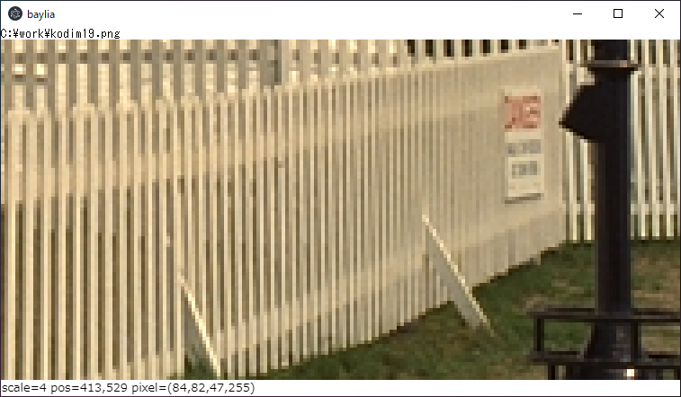
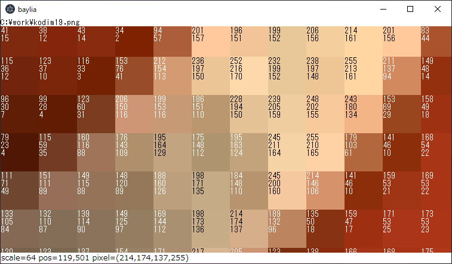

# baylia

Baylia is an Electron application for image characteristics visualization. Scrolling, positioning, and zooming can be performed at high speed while multiple images are displayed side by side. This makes it easy to spot minor differences between images.

## No smoothing zoom

Simple zoom without smoothing effect enables accurate image analysis.

## Pixel value overlay

Baylia provides easy access to pixel values.

## Image broadcasting

By broadcasting a selected image over the other images, slight differences between images can be easily identified.

## Intensity Profile

In addition to displaying profile of an image, it can also work in conjunction with image broadcasting to compare profiles between images.

## Histogram

## Usage

| Key/Mouse | Command |
|-----------|---------|
| Drop files | Open files |
| Left mouse button drag | Scroll |
| Left mouse button hold | Broadcast the image over the others |
| Ctrl + Left mouse button drag | Draw ROI |
| Ctrl + Left mouse button click | Clear ROI |
| Shift + Left mouse button drag and drop | Swap two images |
| Right mouse button click | Show context menu |
| Right mouse button drag | Shift the position of the image |
| Mouse wheel | Zoom in/out |
| z | Zoom in |
| x | Zoom out |
| f | Left-rotate image order |
| g | Right-rotate image order | 
| c | Clear all images |
| q | Quit |

## Supported image formats

- BMP
- PNG
- JPEG
